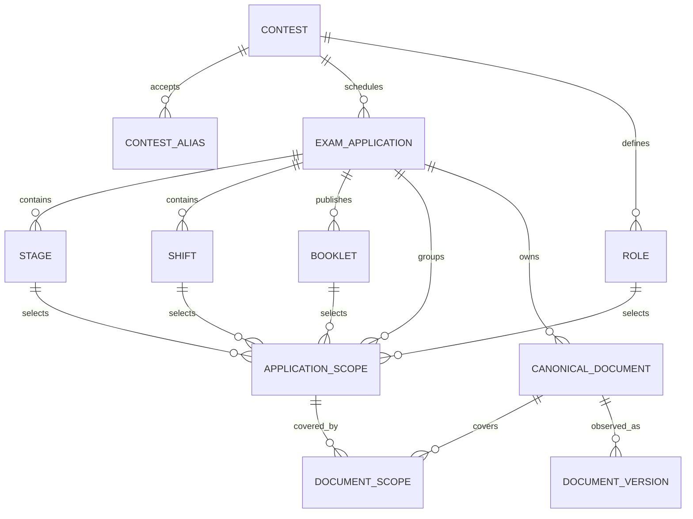

# Identidade canônica de concursos e aplicações

## Problema corrigido

O registro semântico anterior identificava uma prova pela combinação normalizada de banca,
texto do concurso e ano. Cargo, etapa, turno e tipo também permaneciam dentro de JSON. Essa
estrutura ajuda a comparar PDFs, mas não distingue aplicações diferentes do mesmo concurso e
faz um nome editorial participar da identidade.

O catálogo `canonical-identity-v1` atribui IDs estáveis aos conceitos editoriais. Os textos
extraídos continuam preservados como evidência e compatibilidade. O coletor usa os IDs para
relacionar documentos e validar o escopo de um gabarito.

## Modelo



`application_scopes` aplica uma restrição única à combinação aplicação, cargo, etapa, turno e
caderno. `canonical_document_scopes` permite que um caderno cubra o escopo de sua prova e que um
gabarito cubra vários escopos. Cada relação registra o tipo de conteúdo e o intervalo oficial.

## Identificadores

Cada tabela separa três valores:

- `id`: UUID v5 estável usado pelas relações;
- `canonical_key`: chave oficial e imutável usada pelo importador idempotente;
- `display_name`: texto que a equipe pode corrigir sem trocar o ID.

O código gera o UUID com namespace e chave canônica. URL, nome de arquivo, posição em lista e
alias não participam do ID. O importador interrompe a transação caso outra entidade já use a
mesma chave.

## Alias e resolução

`contest_aliases` guarda o texto recebido, a forma normalizada, o tipo, o contexto da fonte e a
evidência. O resolvedor usa igualdade normalizada. Ele retorna `unknown` para uma entrada ausente
e `ambiguous` quando mais de um concurso disputa o alias. Nenhum desses estados escolhe um
concurso.

O fluxo separa duas decisões:

1. `resolve_contest_alias` encontra o concurso;
2. `resolve_application` exige chave, data ou etapa quando o concurso possui mais de uma
   aplicação.

`RFB22` permanece aceito como alias. Relatórios e exportações usam o ID e a chave canônica do
concurso da Receita Federal.

## Documento, observação e versão

O catálogo acrescenta `canonical_documents` acima do registro semântico existente:

- `canonical_documents` representa o documento oficial declarado no manifesto;
- `documents` representa um processamento local;
- `document_observations` preserva os bytes observados e as origens;
- `document_versions` preserva as versões lógicas e sua predecessora.

A migração liga `documents` e `document_versions` ao documento canônico por SHA-256 ou
`external_id`. Ela não altera hashes, páginas, versões, eventos semânticos ou decisões humanas.
Um documento sem correspondência única entra em `canonical_identity_review_queue`.

## Integração com semantic-association-v2

`build_runtime_context` consulta o catálogo antes de comparar prova e gabarito. Quando os dois
documentos possuem identidade canônica, o comparador usa IDs de concurso, cargo, etapa, turno e
caderno. O intervalo objetivo continua vindo das questões e do gabarito extraído.

Documentos ainda não migrados seguem pelo perfil textual da PR 3. Essa compatibilidade permite
adotar o catálogo sem apagar vínculos antigos. A rotina de revalidação continua registrando o
vínculo anterior, o novo vínculo, as comparações e as respostas invalidadas.

## Migração do SQLite

O `DesktopStore` cria as tabelas e colunas aditivas quando abre o banco. O comando abaixo simula
a importação e reverte os dados ao terminar:

```powershell
kad-collector migrate-canonical-identities `
  --database "$env:LOCALAPPDATA\KAD Collector\collector.sqlite3" `
  --manifest tests/regression/rfb22/manifest.v1.toml `
  --contest RFB22 `
  --report data/reports/canonical-identity-dry-run.json
```

Depois de revisar o relatório, aplique a migração com um identificador de execução:

```powershell
kad-collector migrate-canonical-identities `
  --database "$env:LOCALAPPDATA\KAD Collector\collector.sqlite3" `
  --manifest tests/regression/rfb22/manifest.v1.toml `
  --contest RFB22 `
  --apply `
  --run-id canonical-rfb22-2026-08 `
  --report data/reports/canonical-identity-rfb22.json
```

Uma repetição com o mesmo manifesto preserva IDs e contagens. O relatório informa entidades,
documentos e versões vinculados, registros incompletos e ambiguidades.

## Auditoria

O banco mantém:

- `canonical_identity_migration_runs`, com modo, estado e relatório;
- `canonical_identity_mappings`, com cada ID legado e seu destino;
- `canonical_identity_events`, com o evento de conclusão;
- `canonical_identity_review_queue`, com lacunas e candidatos.

Mappings e eventos usam triggers append-only. Uma falha de chave ou alias reverte o catálogo
importado naquela execução.

## Regressão RFB22

O manifesto oficial produz este inventário:

| Entidade | Contagem |
| --- | ---: |
| Concurso | 1 |
| Aliases | 3 |
| Aplicações | 5 |
| Cargos | 2 |
| Aliases de cargo | 2 |
| Etapas | 5 |
| Turnos com documentos publicados | 2 |
| Tipos de caderno | 4 |
| Escopos da aplicação principal | 16 |
| Documentos | 19 |
| Relações documento-escopo | 56 |

As cinco aplicações incluem a prova principal e os cursos de formação inventariados pelo
manifesto. Os 16 cadernos pertencem à aplicação de 19 de março de 2023. A regressão rejeita uma
relação que atravesse aplicações.

## Compatibilidade e remoção futura

Os campos textuais de `metadata_json`, `profile_json` e `QuestionRecord` permanecem nesta versão.
O adaptador de exportação acrescenta `canonicalIdentity` quando o documento já foi migrado e
omite o campo nos lotes legados.

Uma PR posterior poderá remover a dependência editorial dos textos `concurso`, `role`, `stage`,
`turn` e `variant` depois que todos os consumidores aceitarem os IDs. Essa remoção não faz parte
desta migração.

## Limites

- A PR não agrupa questões duplicadas.
- O catálogo não usa IA para escolher concurso, aplicação ou escopo.
- O importador não cria identidade a partir de nome parecido.
- OCR, classificação e enriquecimento editorial seguem em etapas próprias.
