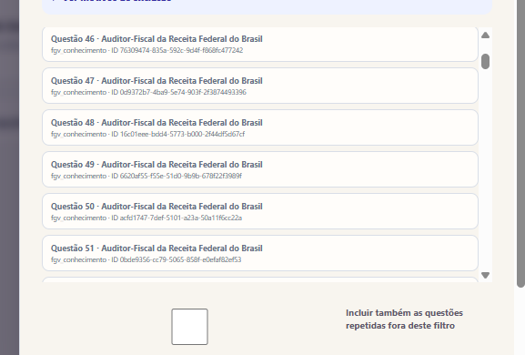
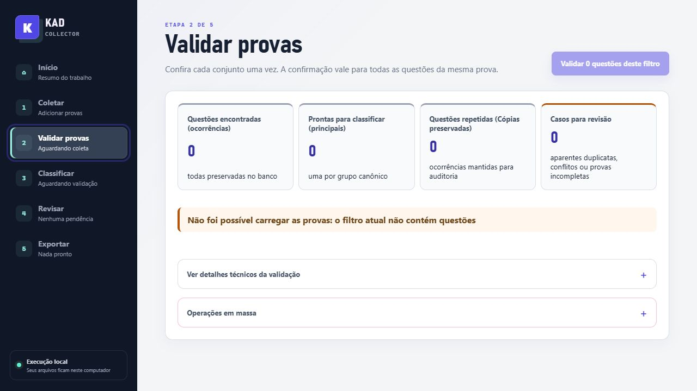

# Auditoria de visibilidade de duplicatas

## Regra operacional

O SQLite é o registro completo da coleta. Cada extração continua registrada como uma
`question` e uma `question_occurrence`, com documento, caderno, páginas, hash e proveniência.
Essa camada não é apagada nem substituída quando outra ocorrência é reconhecida como igual.

Na operação diária, a unidade é a `canonical_question`: uma representante estável por grupo
confirmado. Portanto, uma coleta de 600 ocorrências com 100 cópias confirmadas apresenta 500
questões principais na fila, preserva as 600 ocorrências no banco e exporta no máximo 500 registros.
O detalhe da principal continua mostrando as cópias e suas origens.

## O que cada estado significa

| Estado | Onde aparece | Significado |
| --- | --- | --- |
| Dados completos | Revisão e filtros operacionais | A questão principal tem conteúdo e vínculo de resposta compatíveis. |
| Pronta para exportar | Exportação | A principal foi aprovada e passou pelas validações locais. |
| Já exportada | Histórico e filtros | O Collector já incluiu a principal em um arquivo; isso não confirma que o app externo importou o arquivo. |
| Cópia preservada | Detalhes da principal e auditoria | Ocorrência confirmada como equivalente; permanece no SQLite e não é uma nova unidade editorial. |
| Precisa de revisão | Fila de revisão | Grupo aparente, conflito de resposta, conteúdo incompleto ou outra evidência que impede a confirmação automática. |

## Duplicata confirmada versus aparente

O algoritmo local usa fingerprints determinísticos, alinhamento textual conservador das alternativas
e a fronteira canônica da prova. Enunciado igual com alternativas realmente diferentes, respostas divergentes,
duas ocorrências no mesmo caderno ou conteúdo incompleto não são fundidos silenciosamente.
Esses casos continuam visíveis na fila de revisão, com o motivo registrado em
`question_equivalence_groups.reason` e na fila de revisão. Uma nova execução da equivalência é
idempotente e pode atualizar o grupo sem remover evidência.

O Qwen, a aprovação em lote e a exportação recebem apenas representantes de grupos confirmados.
Assim, cópias não geram chamadas ou registros de exportação duplicados, enquanto casos incertos
continuam disponíveis para decisão humana.

## Conferência local recomendada

1. Trabalhar em uma cópia da base operacional.
2. Executar preparação e equivalência.
3. Conferir a aritmética no resumo: ocorrências preservadas, principais e cópias.
4. Abrir a fila de revisão para grupos conflitantes ou aparentes.
5. Conferir a prévia do Qwen e a prévia de exportação: cada grupo confirmado deve aparecer uma vez.

O Collector não altera a base principal durante testes e não remove documentos, ocorrências,
proveniências ou arquivos já gerados.

## Riscos restantes

- Uma diferença editorial relevante pode ser uma questão legítima; por isso, grupos com variantes,
  conflito ou evidência incompleta permanecem na revisão em vez de serem ocultados.
- Uma semelhança que não fecha os critérios determinísticos pode não ser agrupada automaticamente.
  Isso é intencional: evita apagar uma distinção real e deixa a decisão para a revisão humana.
- `Já exportada` registra somente que o Collector incluiu a principal em um arquivo. A confirmação
  da importação no aplicativo externo continua fora do Collector.
- Bases antigas precisam passar pela preparação/equivalência após a atualização para que a visão
  canônica seja populada; a migração é idempotente e não remove dados.

## Evidência visual

Antes, a lista expunha ocorrências repetidas sem explicar se eram unidades novas ou cópias:

Depois, o resumo separa ocorrências, principais, cópias preservadas e grupos para revisão:

