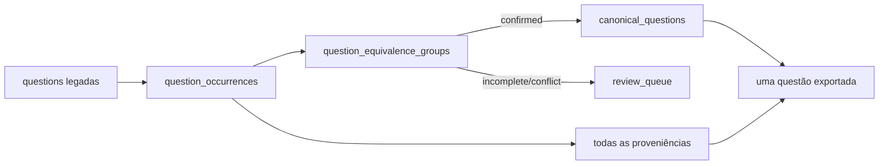

# Equivalência e questão canônica

## Finalidade

`question-equivalence-v1` preserva cada questão extraída como ocorrência e cria uma questão
canônica somente quando as evidências fecham. O modelo substitui o uso editorial da flag
genérica `duplicate`; essa flag continua disponível para compatibilidade e auditoria.



Uma ocorrência mantém o documento e sua versão, escopo, cargo, etapa, turno, caderno, número,
páginas, hash, URL, resposta, vínculo de gabarito e payload extraído. Nenhuma ocorrência é
apagada quando um grupo é confirmado.

## Fronteira de equivalência

Questões só podem compartilhar grupo quando possuem os mesmos IDs canônicos de:

- concurso;
- aplicação;
- cargo;
- etapa;
- turno;
- conteúdo objetivo.

O tipo de caderno fica fora da fronteira porque representa uma ocorrência da mesma questão.
Aplicações, cargos ou turnos diferentes nunca são unidos, mesmo quando o texto coincide.

## Algoritmo determinístico

O algoritmo normaliza Unicode e espaços, remove cabeçalhos de página conhecidos e calcula:

1. fingerprint exato com alternativas na ordem observada;
2. fingerprint de equivalência com os textos das alternativas ordenados;
3. fingerprint apenas do enunciado, usado para detectar colisões com alternativas diferentes.

Não há IA nem desempate silencioso. O alinhamento de alternativas usa similaridade textual
conservadora apenas para tolerar resíduos de extração; não transforma uma semelhança editorial
em confirmação sem as demais evidências. Um grupo só recebe `confirmed` quando cobre todos os
cadernos declarados no catálogo, possui uma ocorrência por caderno, não tem conteúdo incompleto
e todas as respostas vêm de vínculos ativos
`semantic-association-v3`. As letras podem variar entre cadernos; a consolidação compara o
texto normalizado da alternativa correta.

Enunciado igual com alternativas diferentes, respostas divergentes, duas ocorrências no mesmo
caderno ou classificações editoriais incompatíveis produzem `conflict`. Cobertura ou resposta
ausente produz `incomplete`. Conteúdo visual ou escopo incerto produz `needs_review`.

## Representante e fluxo editorial

Cada grupo confirmado escolhe uma representante de forma estável. Decisões humanas aprovadas
ou exportadas têm prioridade, seguidas pela qualidade do documento e pela chave canônica. Só a
representante entra em classificação, enriquecimento, aprovação e exportação. Uma edição de
conteúdo bloqueia o grupo até nova execução da migração.

O contrato `editorial-question-import-v1` inclui `canonicalQuestion`, com ID do grupo, total de
ocorrências e todas as proveniências. O exportador gera um registro e copia os PDFs de evidência
de todas as origens.

## Migração

Simulação, sem persistir ocorrências ou grupos:

```powershell
kad-collector migrate-question-equivalence `
  --database "$env:LOCALAPPDATA\KAD Collector\collector.sqlite3" `
  --contest RFB22 `
  --report data/reports/question-equivalence-rfb22-dry-run.json
```

Aplicação auditável e retomável:

```powershell
kad-collector migrate-question-equivalence `
  --database "$env:LOCALAPPDATA\KAD Collector\collector.sqlite3" `
  --contest RFB22 `
  --apply `
  --run-id equivalence-rfb22-2026-08 `
  --limit 250 `
  --report data/reports/question-equivalence-rfb22.json
```

Repita o comando com o mesmo `run-id` até `remaining` chegar a zero. A operação é transacional e
idempotente. Eventos são append-only e registram o estado anterior, o novo estado e o motivo.

## RFB22

Os intervalos do manifesto resultam em 1.120 ocorrências objetivas: quatro tipos para 280
posições de questão, sendo 140 por cargo. A regressão automatizada cria conteúdo sintético nos
escopos do manifesto e confirma a aritmética `1.120 -> 280`.

Isso não confirma que os 280 grupos reais são equivalentes. Os PDFs oficiais ficam fora do Git;
somente uma execução com os arquivos locais validados por SHA-256 pode confirmar conteúdo,
respostas e conflitos reais. O relatório operacional deve registrar qualquer diferença em vez
de forçar a meta.

## Tabelas e auditoria

- `question_equivalence_runs`: execução, cursor e relatório;
- `question_occurrences`: todas as extrações e proveniências;
- `question_equivalence_groups`: fronteira, evidência e estado;
- `question_group_occurrences`: associação auditável entre grupo e ocorrência;
- `canonical_questions`: representante e estado editorial;
- `question_equivalence_review_queue`: grupos não confirmados;
- `question_equivalence_events`: histórico append-only.

O modelo é aditivo. `questions`, decisões humanas, PDFs, páginas, vínculos de gabarito e flags
legadas permanecem intactos.
